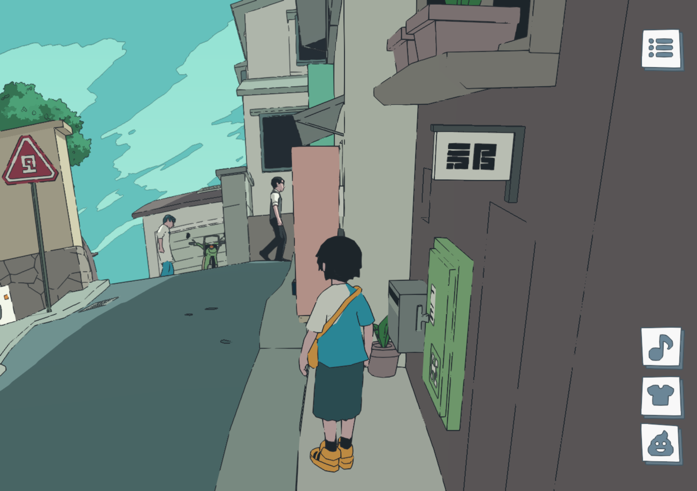
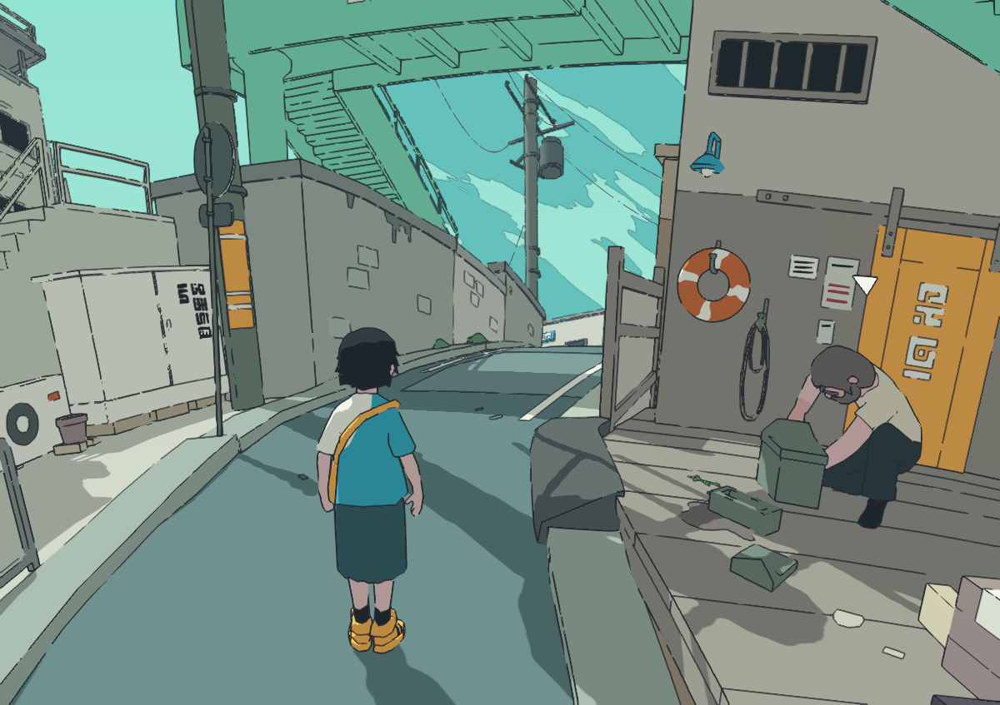
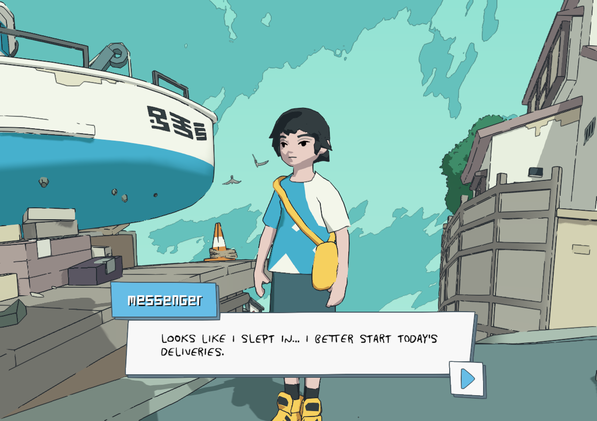

# MESSENGER BY ABETO - Visual Reference Guide
## Complete Screenshot Documentation for NYC Portfolio Implementation

**Source:** https://messenger.abeto.co/
**Purpose:** Developer reference for recreating the Messenger visual style with NYC theme
**Last Updated:** January 2026

---

## Table of Contents

1. [User Journey Overview](#user-journey-overview)
2. [Title Screen & Loading](#1-title-screen--loading)
3. [Tiny Planet View](#2-tiny-planet-view)
4. [Gameplay & Exploration](#3-gameplay--exploration)
5. [Dialogue System](#4-dialogue-system)
6. [UI Elements](#5-ui-elements)
7. [Visual Style Breakdown](#6-visual-style-breakdown)
8. [Technical Observations](#7-technical-observations)

---

## User Journey Overview

```
┌─────────────────────────────────────────────────────────────────┐
│                     MESSENGER USER FLOW                          │
├─────────────────────────────────────────────────────────────────┤
│                                                                  │
│  1. LANDING          2. TITLE SCREEN       3. INTRO DIALOGUE    │
│  ┌─────────┐         ┌─────────────┐       ┌─────────────┐      │
│  │ Loading │    →    │  MESSENGER  │   →   │ Character   │      │
│  │  Planet │         │   [BEGIN]   │       │  speaks     │      │
│  └─────────┘         └─────────────┘       └─────────────┘      │
│                                                   │              │
│                                                   ▼              │
│  6. COMPLETE         5. NPC INTERACT       4. EXPLORATION       │
│  ┌─────────┐         ┌─────────────┐       ┌─────────────┐      │
│  │ Deliver │    ←    │  Dialogue   │   ←   │  Walk       │      │
│  │ Message │         │  with NPCs  │       │  around     │      │
│  └─────────┘         └─────────────┘       └─────────────┘      │
│                                                                  │
└─────────────────────────────────────────────────────────────────┘
```

---

## 1. Title Screen & Loading

### Screenshot: `02-title-screen/title-screen-begin-button.png`


#### What This Shows:
- **The "MESSENGER" title** rendered as 3D block letters on the planet surface
- **"BEGIN" button** - Yellow/orange with clean typography
- **Tiny planet** visible behind the title, already loaded
- **Floating clouds/particles** in the turquoise sky

#### Key Implementation Details:

| Element | Specification |
|---------|---------------|
| **Title Font** | 3D extruded block letters, white with gray shadows |
| **Title Layout** | Stacked: MES / SEN / GER (3 rows) |
| **Background Color** | Turquoise `#5BC4BE` to `#7DD3CF` gradient |
| **Button Color** | Yellow/Orange `#F5A623` with dark outline |
| **Button Text** | "BEGIN" - blocky pixel-style font |
| **Planet Position** | Centered, medium zoom |

#### Code Hints:
```javascript
// Title text as 3D geometry on planet surface
// Each letter is a separate mesh positioned on sphere
const titlePosition = {
  latitude: 45,  // degrees from equator
  scale: 'large enough to read from zoom level'
};

// Begin button - HTML overlay, not 3D
const buttonStyle = {
  background: '#F5A623',
  border: '3px solid #333',
  padding: '12px 40px',
  fontFamily: 'pixel-style',
  position: 'fixed',
  bottom: '15%'
};
```

---

## 2. Tiny Planet View

### Screenshot: `07-tiny-planet/planet-overview-zoomed-out.png`


#### What This Shows:
- **Complete tiny planet** from zoomed-out perspective
- **All regions visible**: residential, docks, industrial areas
- **Spherical world geometry** - everything wraps around
- **Buildings at various angles** conforming to sphere surface
- **Floating debris/clouds** in the atmosphere

#### Key Implementation Details:

| Element | Specification |
|---------|---------------|
| **Planet Radius** | Approximately 50-80 units |
| **Sky Color** | Solid turquoise `#5BC4BE` |
| **Cloud Particles** | White, semi-transparent, scattered |
| **Building Orientation** | All point "outward" from planet center |
| **Ground Color** | Green grass `#7CB342`, gray paths, beige sand |

#### Architectural Zones Visible:
1. **Dock Area** (top-left): Boat, crane, wooden platforms
2. **Residential** (right): Multi-story buildings, apartments
3. **Commercial** (center): Shops with signs
4. **Green Areas**: Trees, grass patches throughout

#### Code Hints:
```javascript
// Camera position for planet overview
const overviewCamera = {
  distance: planetRadius * 3.5,  // Far enough to see whole planet
  fov: 50,
  lookAt: planetCenter
};

// Object placement on sphere surface
function placeOnPlanet(object, lat, lon, heightOffset = 0) {
  const pos = latLonToCartesian(lat, lon, planetRadius + heightOffset);
  object.position.copy(pos);
  object.lookAt(planetCenter);  // Orient "up" = away from center
  object.rotateX(Math.PI / 2);  // Adjust for model orientation
}
```

---

## 3. Gameplay & Exploration

### Screenshot: `03-gameplay-exploration/character-front-view-docks.png`


#### What This Shows:
- **Main character** front view - detailed cel-shaded style
- **Character design**: Short black hair, blue shirt with white triangle logo, yellow messenger bag, yellow shoes
- **Docks environment**: Wooden platforms, boat with Korean text "오늘도"
- **Atmospheric sky**: Turquoise with brushstroke-style clouds

#### Character Design Specifications:

| Feature | Detail |
|---------|--------|
| **Hair** | Black, short bob cut, clean silhouette |
| **Skin** | Pale with subtle shading (3 tones) |
| **Shirt** | Light blue `#5DADE2` with white triangle |
| **Bag** | Yellow `#F5B041` cross-body messenger bag |
| **Shorts** | Dark teal/gray `#4A6670` |
| **Shoes** | Yellow `#F5B041` sneakers |
| **Outline** | 2-3px dark lines on all edges |

---

### Screenshot: `03-gameplay-exploration/character-side-view-boat.png`


#### What This Shows:
- **Third-person camera** positioned behind and to the side
- **UI buttons visible** (top-right and bottom-right)
- **Boat detail**: White hull, blue bottom, crane structure
- **Traffic cone** and crates as props

#### Camera System:

| Parameter | Value |
|-----------|-------|
| **Follow Distance** | ~8-10 units behind player |
| **Height Offset** | ~3-4 units above player |
| **FOV** | ~60 degrees |
| **Smooth Follow** | Lerp factor 0.1 |

---

### Screenshot: `03-gameplay-exploration/street-scene-npcs-buildings.png`



#### What This Shows:
- **Multiple NPCs** walking around (3 visible)
- **Building variety**: Pink/salmon colored wall, gray buildings, signs
- **Street props**: Road sign with omega symbol, potted plants, green utility box
- **Curved streets** following planet surface

#### NPC Design:
- Simple silhouettes, similar style to player
- Various clothing colors
- Walking animations
- Non-interactive ambient characters

#### Environmental Props Visible:
1. Triangular road sign (red with white symbol)
2. Green electrical/utility box
3. Potted plant at doorway
4. Bicycle parked against wall
5. Gray mailbox

---

### Screenshot: `03-gameplay-exploration/street-with-npc-interaction.png`



#### What This Shows:
- **Industrial/dock area** with overhead structure
- **NPC bending over** examining something
- **Life preserver** on wall (orange/white)
- **Yellow doors** on building
- **Power lines and poles** overhead
- **Arrow cursor** visible (interaction possible)

#### Props for NYC Adaptation:
| Messenger Prop | NYC Equivalent |
|----------------|----------------|
| Life preserver | Fire hydrant |
| Korean signs | NYC street signs |
| Small utility boxes | NYC newspaper stands |
| Wooden docks | Concrete sidewalks |

---

## 4. Dialogue System

### Screenshot: `04-dialogue-npc/dialogue-box-messenger-speaking.png`



#### What This Shows:
- **Dialogue box** with rounded corners at bottom of screen
- **Speaker label** "MESSENGER" in blue pill-shaped badge
- **Dialogue text**: "LOOKS LIKE I SLEPT IN... I BETTER START TODAY'S DELIVERIES."
- **Continue indicator**: Blue arrow button (bottom-right of dialogue box)
- **Camera framing**: Character visible during dialogue

#### Dialogue Box Specifications:

| Element | Specification |
|---------|---------------|
| **Box Background** | White `#FFFFFF` |
| **Box Border** | Dark gray `#333333`, 3px |
| **Box Corners** | Rounded, ~12px radius |
| **Box Width** | ~70% of screen width |
| **Box Position** | Bottom, ~10% from edge |
| **Speaker Badge** | Blue `#3498DB` pill shape |
| **Speaker Text** | White, bold, uppercase |
| **Dialogue Font** | Pixel/blocky style, ALL CAPS |
| **Dialogue Color** | Dark gray `#333333` |
| **Continue Button** | Blue arrow in white rounded square |

#### Code Hints:
```css
.dialogue-box {
  background: #FFFFFF;
  border: 3px solid #333333;
  border-radius: 12px;
  padding: 20px;
  position: fixed;
  bottom: 10%;
  left: 15%;
  right: 15%;
}

.speaker-badge {
  background: #3498DB;
  color: white;
  padding: 8px 16px;
  border-radius: 20px;
  font-weight: bold;
  text-transform: uppercase;
  position: absolute;
  top: -15px;
  left: 20px;
}

.dialogue-text {
  font-family: 'PixelFont', monospace;
  text-transform: uppercase;
  color: #333333;
  font-size: 18px;
  line-height: 1.5;
}
```

---

## 5. UI Elements

### Screenshot: `05-ui-elements/ui-buttons-right-side.png`


#### UI Button Panel (Right Side):

| Button | Icon | Function |
|--------|------|----------|
| **Top** | Three horizontal lines (menu) | Open menu/settings |
| **Music** | Musical note | Toggle music on/off |
| **Outfit** | T-shirt | Change character outfit |
| **Expression** | Face/emoji | Change character expression |

#### Button Design Specifications:

| Property | Value |
|----------|-------|
| **Background** | White `#FFFFFF` |
| **Border** | Dark gray `#333333`, 2px |
| **Border Radius** | 8px |
| **Size** | ~44px x 44px |
| **Icon Color** | Dark gray `#333333` |
| **Spacing** | ~12px between buttons |
| **Position** | Fixed, right side, vertically stacked |

#### Code Hints:
```css
.ui-button {
  width: 44px;
  height: 44px;
  background: #FFFFFF;
  border: 2px solid #333333;
  border-radius: 8px;
  display: flex;
  align-items: center;
  justify-content: center;
  cursor: pointer;
  transition: transform 0.1s ease;
}

.ui-button:hover {
  transform: scale(1.05);
}

.ui-button-panel {
  position: fixed;
  right: 20px;
  top: 50%;
  transform: translateY(-50%);
  display: flex;
  flex-direction: column;
  gap: 12px;
}
```

---

## 6. Visual Style Breakdown

### Color Analysis

#### Sky/Background:
```
Primary Sky: #5BC4BE (Turquoise)
Sky Variation: #7DD3CF (Lighter turquoise)
Cloud Color: #FFFFFF @ 60% opacity
Cloud Brushstrokes: #B8E0DC (Muted turquoise)
```

#### Character Colors:
```
Skin Light: #F5DEB3
Skin Mid: #DEB887
Skin Shadow: #CD853F
Hair: #1A1A1A (Pure black, no gradient)
Shirt Blue: #5DADE2
Bag Yellow: #F5B041
Shoes Yellow: #F5B041
Shorts: #4A6670
```

#### Environment Colors:
```
Grass Green: #7CB342
Path Gray: #9E9E9E
Wood Brown: #8D6E63
Building Cream: #F5F5DC
Building Gray: #BDBDBD
Building Pink: #FFCDD2
Water Blue: #4FC3F7
```

### Outline Style

**CRITICAL: Everything has outlines!**

```
Outline Color: #333333 (Dark gray, NOT pure black)
Outline Width: 2-3 pixels
Outline Method: Inverted hull technique
- Duplicate mesh
- Scale slightly larger (1.02-1.03x)
- Flip normals
- Render behind original
```

### Cel-Shading Bands

```
Band 1 (Light):    100% saturation, direct light
Band 2 (Mid):      70% saturation, ambient light
Band 3 (Shadow):   40% saturation, away from light

TRANSITION: Sharp! No gradual blending between bands
SHADOW TINT: Slightly purple/cool, never pure gray
```

### Cloud/Sky Brushstroke Effect

The sky isn't solid - it has painterly brushstrokes:

```
- Base: Solid turquoise #5BC4BE
- Brushstrokes: Lighter turquoise #7DD3CF
- Direction: Horizontal, varied opacity
- Effect: Hand-painted, Studio Ghibli-esque
```

---

## 7. Technical Observations

### Rendering Techniques

1. **Cel-Shading**: Custom shader with 3-band lighting
2. **Outlines**: Inverted hull method (not post-processing)
3. **Shadows**: Soft, slightly purple-tinted
4. **No Ambient Occlusion**: Clean, flat shadows only
5. **No Bloom**: Pure colors, no glow effects
6. **Film Grain**: Subtle, barely noticeable (2-3%)

### Camera Behavior

```javascript
// Observed camera behavior
const cameraConfig = {
  // Third-person follow
  followDistance: 8,
  heightOffset: 4,
  lookAheadDistance: 2,

  // Smoothing
  positionLerp: 0.1,
  rotationLerp: 0.08,

  // Planet-aware
  // Camera stays "above" the ground relative to planet surface
  // Adjusts orientation as player walks around sphere

  // Collision
  // Doesn't clip through buildings
  // Smoothly adjusts distance when obstructed
};
```

### Performance Notes

- Low-poly models (< 5000 triangles per building)
- Instanced rendering for repeated props
- LOD not heavily used (small world)
- Texture resolution: 512x512 or 1024x1024 max
- Draw distance: Entire planet always visible

### Animation Style

```javascript
// Character animation
const animationConfig = {
  walkSpeed: 4,  // units per second
  runSpeed: 8,

  // Idle
  idleBreathing: true,  // Subtle up-down
  idleLookAround: true, // Occasional head turn

  // Walk cycle
  armSwing: true,
  footstepInterval: 0.5,  // seconds

  // Style
  // Smooth but not floaty
  // Grounded, weighted feel
  // Quick responsiveness to input
};
```

---

## NYC Adaptation Mapping

| Messenger Element | NYC Portfolio Equivalent |
|-------------------|--------------------------|
| Tiny planet | NYC block/intersection |
| Docks area | Hudson River pier |
| Residential buildings | Brownstones |
| Commercial area | Storefronts (Skills, Projects, etc.) |
| Boat | Yellow taxi (parked) |
| Korean signs | NYC street signs, neon shop signs |
| Life preserver | Fire hydrant |
| Traffic cone | Traffic cone (same!) |
| Trees | City trees in grates |
| NPCs walking | Pedestrians |
| Messenger bag | Portfolio/briefcase |

---

## Quick Reference Cards

### Color Palette (Copy-Paste Ready)

```css
:root {
  /* Sky */
  --sky-primary: #5BC4BE;
  --sky-light: #7DD3CF;
  --cloud-white: rgba(255, 255, 255, 0.6);

  /* Character */
  --char-shirt: #5DADE2;
  --char-bag: #F5B041;
  --char-hair: #1A1A1A;
  --char-shorts: #4A6670;

  /* UI */
  --ui-bg: #FFFFFF;
  --ui-border: #333333;
  --ui-accent: #3498DB;
  --ui-button-yellow: #F5A623;

  /* Environment */
  --env-grass: #7CB342;
  --env-path: #9E9E9E;
  --env-wood: #8D6E63;

  /* Outlines */
  --outline-color: #333333;
  --outline-width: 2px;
}
```

### Font Stack

```css
/* Dialogue/UI text */
font-family: 'Press Start 2P', 'Courier New', monospace;

/* Or custom pixel font */
@font-face {
  font-family: 'MessengerPixel';
  src: url('/fonts/pixel.woff2') format('woff2');
}
```

---

## File Inventory

```
docs/messenger-reference/
├── MESSENGER-VISUAL-REFERENCE-GUIDE.md (this file)
├── 02-title-screen/
│   └── title-screen-begin-button.png
├── 03-gameplay-exploration/
│   ├── character-front-view-docks.png
│   ├── character-side-view-boat.png
│   ├── character-back-view-walking.png
│   ├── street-scene-npcs-buildings.png
│   ├── close-up-back-view.png
│   ├── residential-street-scene.png
│   └── street-with-npc-interaction.png
├── 04-dialogue-npc/
│   └── dialogue-box-messenger-speaking.png
├── 05-ui-elements/
│   └── ui-buttons-right-side.png
└── 07-tiny-planet/
    └── planet-overview-zoomed-out.png
```

---

**Document Version:** 1.0
**Created For:** NYC Portfolio Development Team
**Reference Source:** https://messenger.abeto.co/
